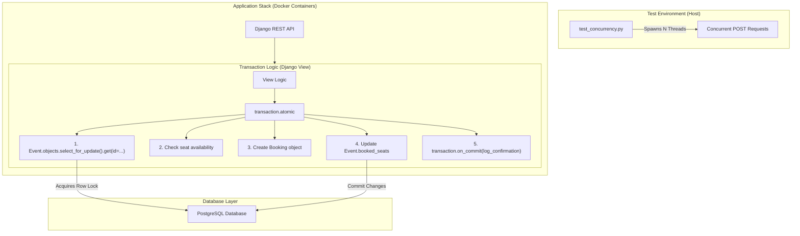

#  Race-Condition-Proof Django Ticketing API

A robust, containerized Django API designed to demonstrate and resolve critical race conditions in high-concurrency environments. This project showcases industry-standard locking mechanisms (Pessimistic & Optimistic) and atomic transaction management to ensure 100% data integrity during seat bookings.

---

##  System Architecture

The following diagram illustrates the flow of a concurrent booking request through our application stack, highlighting the transactional integrity and row-level locking mechanism.



---

##  Key Features

### 1. Advanced Locking Mechanisms
*   **Vulnerable Implementation**: A "read-modify-write" pattern without locking, demonstrating how concurrent requests can overwrite each other (Lost Update problem).
*   **Pessimistic Locking**: Utilizes `SELECT FOR UPDATE` to lock the event row at the database level, ensuring that only one transaction can modify a specific event at a time.
*   **Optimistic Locking**: Implements versioning. Each update checks if the `version` matches the one read initially. If it doesn't, the update fails, preventing "dirty" writes.

### 2. Transactional Integrity
*   **Atomic Blocks**: All booking logic is wrapped in `transaction.atomic()`, ensuring that if any step fails (e.g., no seats left), the entire operation is rolled back.
*   **On-Commit Hooks**: Uses `transaction.on_commit()` to trigger side effects (like logging or email confirmations) only **after** the transaction has been successfully recorded in the database.

### 3. Fully Containerized
*   **Docker Compose**: Manages the Django application and PostgreSQL database.
*   **Healthchecks**: The API service waits for the database to be "Healthy" before starting, preventing startup failures.

---

##  Installation & Setup

### Prerequisites
*   [Docker](https://www.docker.com/get-started) & [Docker Compose](https://docs.docker.com/compose/install/)
*   Python 3.10+ (to run the test script)

### 1. Clone & Initialize
```bash
git clone <repository-url>
cd race-condition-ticketing-api
cp .env.example .env
```

### 2. Launch Services
```bash
docker-compose up --build -d
```
*The system will automatically run migrations and seed the database with an initial event (30 seats).*

### 3. Verify Health
```bash
docker-compose ps
# Ensure both 'web' and 'db' are running
```

---

##  Concurrency Testing

The included `test_concurrency.py` script stress-tests the API by sending 50 simultaneous requests to each endpoint.

### Run the Test
```bash
python test_concurrency.py
```

### Understanding the Results (`results.json`)
| Endpoint | Expected Outcome | Reality (Vulnerable) |
| :--- | :--- | :--- |
| **Vulnerable** | Overbooking / Lost Updates | 50 success, but < 30 seats in DB |
| **Pessimistic** | Exactly 30 bookings | 30 success, 20 failed, 30 seats in DB |
| **Optimistic** | Integrity Preserved | 30 success, some 409 Conflicts |

---

##  API Endpoints

| Method | Endpoint | Description |
| :--- | :--- | :--- |
| `POST` | `/api/events/1/book_vulnerable/` | Demonstrates the race condition. |
| `POST` | `/api/events/1/book_pessimistic/` | Safe booking via Pessimistic locking. |
| `POST` | `/api/events/1/book_optimistic/` | Safe booking via Optimistic locking. |
| `POST` | `/api/events/1/book_pessimistic_fail/` | Tests rollback & on_commit behavior. |
| `GET` | `/api/events/1/status/` | Returns current seats and version. |
| `POST` | `/api/events/1/reset/` | Resets the event state for testing. |

---

##  Technical Implementation Notes

### The `on_commit` Side Effect
In `views.py`, we use:
```python
transaction.on_commit(lambda: log_confirmation(event_id))
```
This ensures that the "CONFIRMATION" log entry in Docker only appears if the transaction was successful. If the transaction rolls back (as in the `_fail` endpoint), the log is suppressed, preventing false confirmation messages.

---

##  License
This project is for educational purposes demonstrating database concurrency patterns.

---

##  Locking Strategy Comparison

| Strategy | Implementation | Pros | Cons |
| :--- | :--- | :--- | :--- |
| **None** | Read -> Logic -> Write | Fast, Simple | Data corruption under load |
| **Pessimistic** | `select_for_update()` | Guarantees integrity | Can lead to DB deadlocks/timeout |
| **Optimistic** | `WHERE version = read_version` | High throughput | Fails on high contention |

